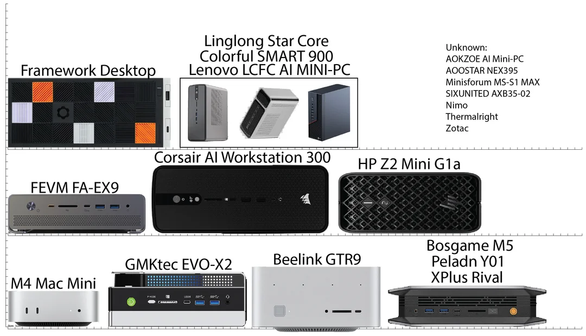
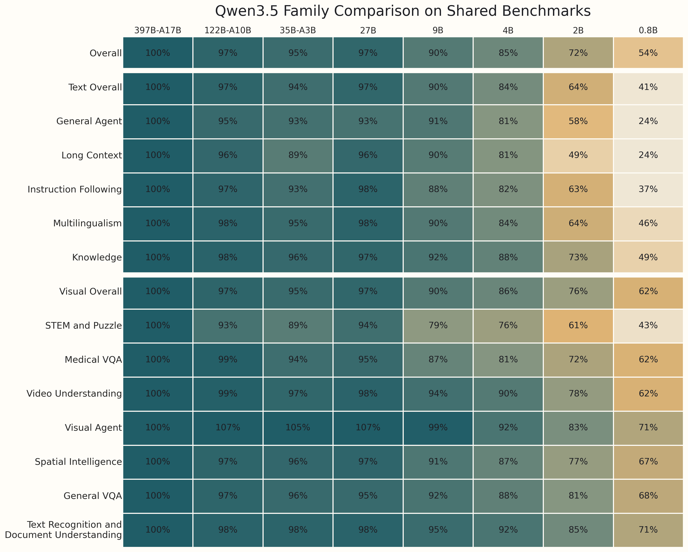
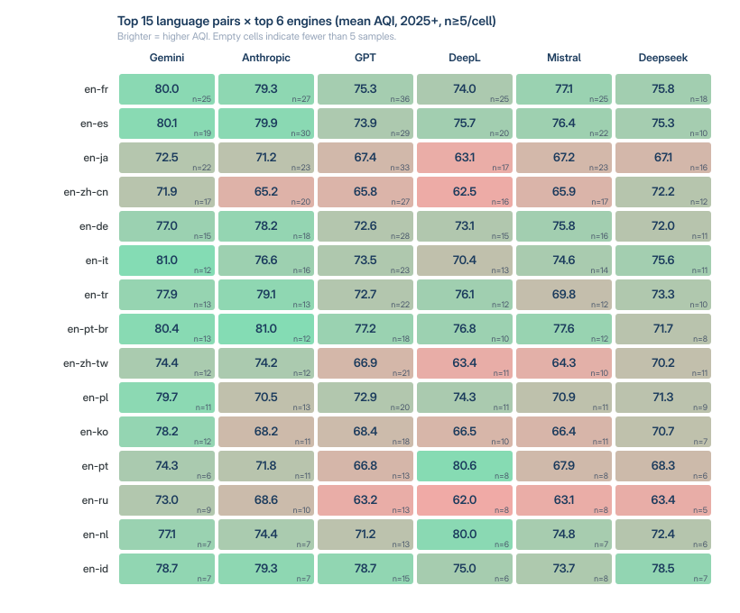

# ul-ialt-04-tlg-2004

> 2026-05-19, 11:15-12:45, [04-TLG-2004.SE01 Probleme und Methoden der
> Übersetzung](http://web.archive.org/web/20260427185142/https://almaweb.uni-leipzig.de/scripts/mgrqispi.dll?APPNAME=CampusNet&PRGNAME=COURSEDETAILS&ARGUMENTS=-N000000000000001,-N000590,-N0,-N396874687513055,-N396874687522056,-N0,-N0,-N0)

> [Martin Czygan](martin.czygan@gmail.com), SWE at Leipzig University Library;
> previously Lecturer at Lancaster University and HAW Hamburg, and Open Data
> Engineer at Internet Archive

## Local LLM and notes on LLM for translation

Three questions for today:

* What is a local LLM and how can I work work with one?
* Are there local LLM specifically for translations?
* How does context influence translations quality?

## Disclaimer

* language models are like any other machine, they can be benefit or a hazard; "[Traum oder Alptraum](https://blog.ub.uni-leipzig.de/ki-ein-traum-oder-alptraum-fuer-die-bibliothek/)"
* there is enough room between being luddite about it and blindly cheering it up
* AI has lots of negative externalities

> Negative Externality (Cost): An action that imposes unintended costs on
> others

Where I use and avoid working with an LLM:

* OK: code snippets, transcripts, quick summaries, tutor
* NO: prose for human consumption, as I feel LLMs can [distort our written language](https://arxiv.org/abs/2603.18161)

Observation for my field: deeply affected, agentic coding becoming mainstream
fast; very different speeds of adoption, wide variety of results:

> AI tools have seduced many people into a false belief that these fundamentals
> no longer apply. People brag about codebases of hundreds of thousands of
> lines that have never been viewed by people, churned out in record time. On
> closer inspection, these codebases inevitably turn out to be more like
> dancing elephants than useful engineering artifacts.

## Before we start

### Your LLM background

> How often do you reach to an LLM (or VLM, LMM, ...)?

* daily use: 2-3
* moderate: 8-12
* never: 0

### Most used tool and interaction mode

> You tell me, there are many different combinations. Anything you like, or dislike?

* Perplexity, note summary
* ChatGPT, website, app
* Copilot, per button
* Deepl

## What is a local LLM and how can I work with one?

A local LLM (or any model) is also called open-weights. Given hardware, you can run it yourself.

### Why Local Models

* ownership vs renting
* a level of autonomy, control, privacy, predictability and freedom

[The Latent Role of Open Models in the AI
Economy](https://papers.ssrn.com/sol3/papers.cfm?abstract_id=5767103) (2025),
"Closed models dominate, with on average 80% of monthly LLM tokens using closed
models despite much higher prices — on average 6x the price of open models —
and only modest performance advantages"

> This systematic underutilization
is **economically significant**: reallocating demand from observably dominated
closed models to superior open models would reduce average prices by over 70%
and, when extrapolated to the total market, generate an **estimated $24.8
billion in additional consumer savings across 2025**.

### Why not

* usually less capable models (fewer parameters, quantized)
* you will need hardware (laptop, desktop), or access to hardware (server, data center)
* if you start from scratch, a useful setup may cost between EUR 1-8K (and since EOY25 we additionally have a full on [RAM crisis](https://en.wikipedia.org/wiki/2024%E2%80%93present_global_memory_supply_shortage))
* more initial setup, heterogeneous model landscape; early adopter pains

Some consumer market machines in 2026:

* [AMD Strix Halo APU](https://strixhalo.wiki/Guides/Buyer's_Guide) based
  systems, [Mac mini](https://www.apple.com/de/mac-mini/), [Mac
  Studio](https://www.apple.com/de/mac-studio/), anything with an [Nvidia
  GPU](https://en.wikipedia.org/wiki/List_of_Nvidia_graphics_processing_units)

Many models will run even on single board computers (e.g. raspberry pi, N150
based boards, ...), but just slowly; cf. [can i run?](https://www.canirun.ai/)

An example of performance regression caused by lower parameters counts
([source](https://old.reddit.com/r/LocalLLaMA/comments/1ro7xve/qwen35_family_comparison_on_shared_benchmarks/)):

A Strix Halo (128GB) box runs 122B-A10B (88GB) with PE/PP of 68/21 t/s.

### Evaluations

Capabilities are evaluated with benchmarks and benchmark datasets; examples:

* GPQA
* MMLU
* MMLU-Pro
* AIME 2025
* MATH
* HumanEval
* MMMU
* LiveCodeBench
* IFEval
* GSM8K
* SWE-Bench Verified
* and many more ...

Benchmarks highlight particular aspects of language models.

> A primary origin of over-hyped AI capabilities is the fact that many AI
> systems are developed in sterile R&D environments and then deployed in more
> complex real-world settings without appropriate testing or oversight. --
> [Misrepresented Technological Solutions in Imagined Futures: The Origins and
> Dangers of AI Hype in the Research
> Community](https://arxiv.org/pdf/2408.15244)

Leaderboards exists:

* [LLM Leaderboard - Comparison of over 100 AI models from OpenAI, Google, DeepSeek & others](https://artificialanalysis.ai/leaderboards/models)
* [https://llm-stats.com/](https://llm-stats.com/)
* [https://onyx.app/llm-leaderboard](https://onyx.app/llm-leaderboard)

Linguistic evals exits, but can also be combined.

* [Best LLM for Translation in 2026: A Data-Driven Engine Scoreboard](https://alconost.com/en/blog/best-llm-for-translation-2026)

> We ran 5,632 machine-translation evaluations on real client projects in 2025 and 2026.

They create an index from various benchmarks, including manual review ("LE", "linguist evaluation"):

> * COMET (30%): a neural framework that correlates strongly with human judgment.
> * LE, Linguist Evaluation (20%): a 0 to 100 score given by a professional native-speaker linguist. Always present in our calculation.
> * nTER (15%): edit-distance metric that reflects post-editing effort.
> * BERTscore (15%): contextual similarity using transformer embeddings.
> * BLEU (10%): the historic n-gram precision metric, intentionally down-weighted because surface overlap is a known weak signal in 2026.
> * CHrF++ (5%): character n-gram metric, useful for morphologically rich languages.
> * COMET-QE / CometKiwi (5%): reference-free quality estimation.

Note: it would be great to run these benchmarks across smaller, specialized
models, maybe with additional parameters, etc.

## Are there local LLM specifically for translations?

### Background

* Various paradigms: Statistical machine translation
  ([SMT](https://en.wikipedia.org/wiki/Statistical_machine_translation)),
Rule-based machine translation
([RBMT](https://en.wikipedia.org/wiki/Rule-based_machine_translation)), [EBMT](https://en.wikipedia.org/wiki/Example-based_machine_translation), ...

Wikipedia categories:

> Dictionary-based, Rule-based, Transfer-based, Statistical, Example-based, Interlingual, Neural, Hybrid

Current wave: Neural machine translation ([NMT](https://en.wikipedia.org/wiki/Neural_machine_translation))

> Neural machine translation is a recently proposed approach to machine
> translation. Unlike the traditional statistical machine translation, the
> neural machine translation aims at building a single neural network that can
> be jointly tuned to maximize the translation performance. -- [NEURAL MACHINE TRANSLATION BY JOINTLY LEARNING TO ALIGN AND TRANSLATE](https://arxiv.org/pdf/1409.0473) (05/2016)

Jump to 2014:

* [Sequence to Sequence Learning with Neural Networks](https://arxiv.org/pdf/1409.3215) (12/2014)

> For example, speech recognition and **machine translation are sequential
> problems** [...] Bahdanau et al. [2] also attempted direct translations with
> a neural network that used an **attention mechanism** to overcome the poor
> performance on long sentences experienced by Cho et al. [5] and achieved
> encouraging results. [...]

Jump to 2026:

* [translategemma](https://arxiv.org/pdf/2601.09012) (01/2026)

> To this end, we present TranslateGemma, an open variant of the Gemma 3
> foundation model (Gemma Team, 2025), specifically enhanced for machine
> translation.

* [tencent HY-MT1.5](https://arxiv.org/pdf/2512.24092) (12/2025)

> HY-MT1.5-1.8B, the 1.8B-parameter model demonstrates remarkable parameter
> efficiency, comprehensively outperforming significantly larger open-source
> baselines (e.g., Tower-Plus-72B, Qwen3- 32B) and mainstream commercial APIs
> (e.g., Microsoft Translator, Doubao Translator) in standard Chinese-foreign
> and English-foreign tasks.

* [NLLB](https://huggingface.co/docs/transformers/en/model_doc/nllb),
  [nllb-200-3.3B](https://huggingface.co/facebook/nllb-200-3.3B) ("Primary
intended uses: NLLB-200 is a machine translation model primarily intended for
research in machine translation, - especially for low-resource languages. It
allows for single sentence translation among 200 languages.") (2022)
* [Omnilingual MT: Machine Translation for 1,600 Languages](https://arxiv.org/pdf/2603.16309)
* ...

In general, specialized models can outperform generic models (but it is not required):

>  Notably, all our 1B to 8B parameter models match or exceed the MT
>  performance of a 70B LLM baseline, revealing a clear specialization
>  advantage and enabling strong translation quality in low-compute settings --
>  [Omnilingual MT](https://arxiv.org/pdf/2603.16309)

Open Eval Dataset: [BOUQuET: dataset, Benchmark and Open initiative for
Universal Quality Evaluation in Translation](https://arxiv.org/pdf/2502.04314)

> [...] there have been several initiatives that called for data annotation in
> a collaborative and open way, such as the translation data collection
> initiative [...]

### Finding models

On HF, we find about 12K models under the [*translation*](https://huggingface.co/models?pipeline_tag=translation) tag.

Some noteable models:

* [translategemma](https://blog.google/innovation-and-ai/technology/developers-tools/translategemma/) (01/2026)
* tencent [HY-MT 1.5](https://arxiv.org/abs/2512.24092) (12/2025)

Not available, fine-tuned from Qwen3 (which is available):

* [qwen-mt](https://qwen.ai/blog?id=qwen-mt) (07/2025)

Models come with prompt templates; used during training that are optimal for the task. Example prompt template for translategemma, from their [technical report](https://arxiv.org/pdf/2601.09012#page=6):

> You are a professional {source_lang} ({src_lang_code}) to {target_lang}
> ({tgt_lang_code}) translator. Your goal is to accurately convey the meaning
> and nuances of the original {source_lang} text while adhering to
> {target_lang} grammar, vocabulary, and cultural sensitivities. Produce only
> the {target_lang} translation, without any additional explanations or
> commentary. Please translate the following {source_lang} text into
> {target_lang}:\n\n\n{text}

The HY-MT1.5 model support prompt templates and additional, practical helpers,
like: "Terminology Translation", "Context Translation", ...

### Evaluation

* [WMT25](https://aclanthology.org/2025.wmt-1.22.pdf), "WMT25 General Machine Translation Shared Task"

An approach to use a NN for evaluation of NN outputs. Also with translation:

> We present COMET, a neural framework for training multilingual machine
> translation evaluation models which obtains new state-of-the-art levels of
> correlation with human judgements. -- [COMET: A Neural Framework for MT
> Evaluation](https://aclanthology.org/2020.emnlp-main.213.pdf) (2020)

In general, there is a technique called LLM-as-a-judge, or also human preference (arena).

#### Vibe Checks

> In my tests translating between Arabic <-> English and Korean -> English,
> Gemma4 26B/31B is way better than translategemma, you should definitely
> upgrade to that. --
> [/r/LocalLLaMA/comments/1sl5k6d/comment/og4416d/](https://www.reddit.com/r/LocalLLaMA/comments/1sl5k6d/comment/og4416d/)

### Top 30 Models

All time:

Since 2025:

Since 2026:

## How does context influence translations quality?

Various options:

* Prompting (add more context; note that translategemma has [only](https://huggingface.co/google/translategemma-4b-it/discussions/2) 2K context)
* Agentic Translation (similar to agentic coding)

Examples from HY-MT1.5:

* Scenario 1: Terminology Translation
* Scenario 2: Context Translation
* Scenario 3: Format Translation

Unfortunately, the examples seem to be [in
chinese](https://huggingface.co/tencent/HY-MT1.5-1.8B#prompts).

But we can do some experiments with generic models.

