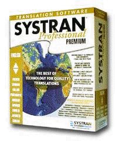
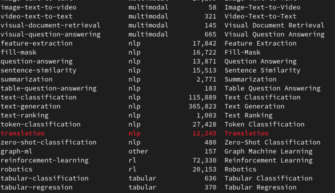
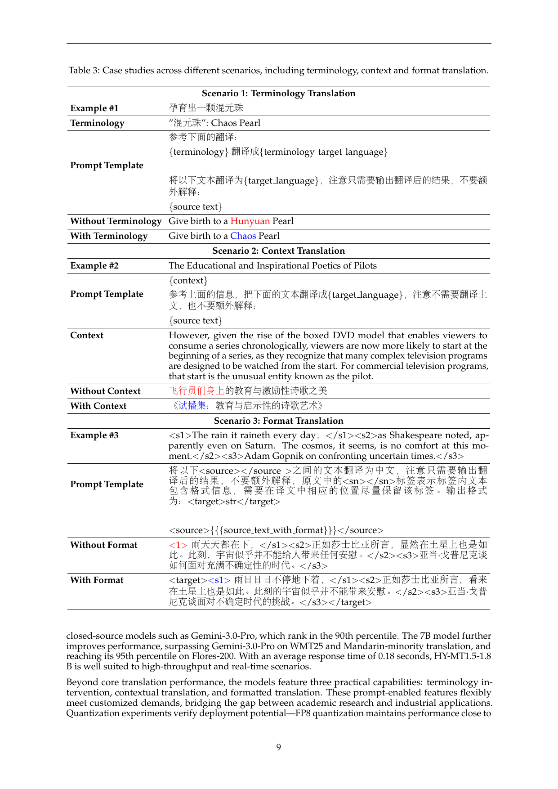
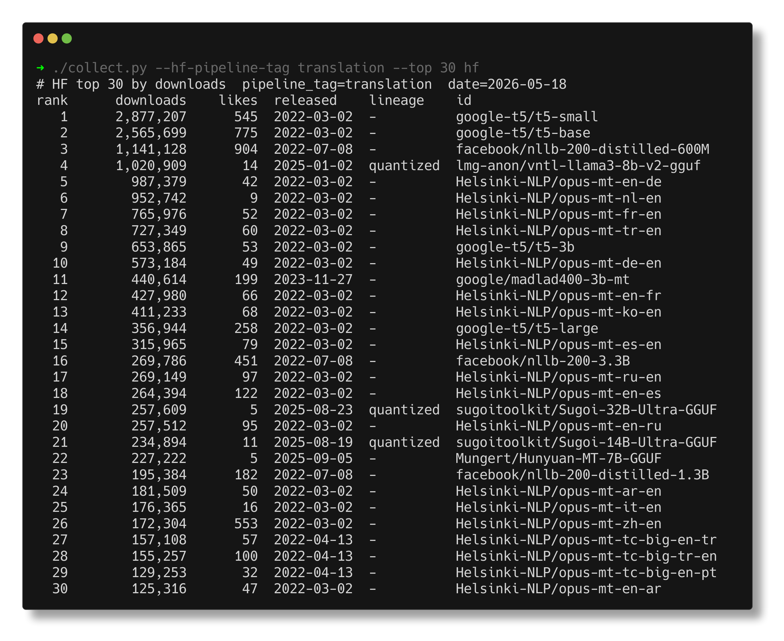
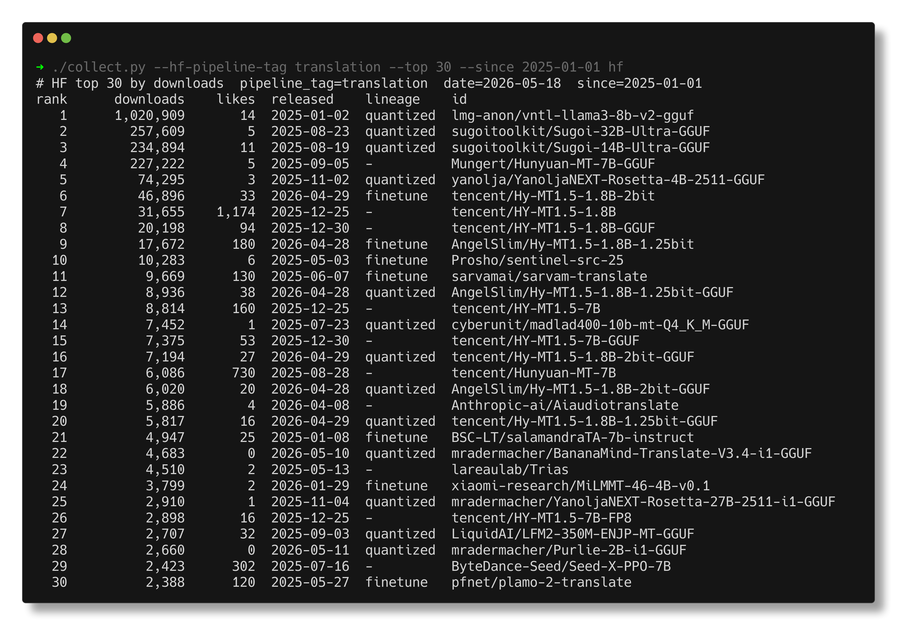
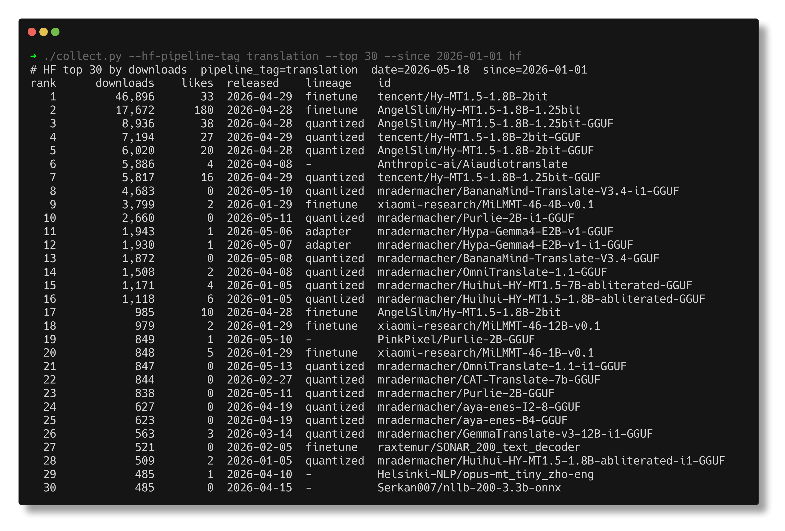

# ul-ialt-04-tlg-2004

> 2026-05-19, 11:15-12:45, [04-TLG-2004.SE01 Probleme und Methoden der
> Übersetzung](http://web.archive.org/web/20260427185142/https://almaweb.uni-leipzig.de/scripts/mgrqispi.dll?APPNAME=CampusNet&PRGNAME=COURSEDETAILS&ARGUMENTS=-N000000000000001,-N000590,-N0,-N396874687513055,-N396874687522056,-N0,-N0,-N0)

> [Martin Czygan](martin.czygan@gmail.com), SWE at Leipzig University Library;
> previously Lecturer at Lancaster University and HAW Hamburg, and Open Data
> Engineer at Internet Archive

## Local LLM and notes on LLM for translation

Three questions for today:

* What is a local LLM and how can I work work with one?
* Are there local LLM specifically for translations?
* How does context influence translations quality?

## Disclaimer

* language models are like any other machine, they can be benefit or a hazard; "[Traum oder Alptraum](https://blog.ub.uni-leipzig.de/ki-ein-traum-oder-alptraum-fuer-die-bibliothek/)"
* there is enough room between being luddite about it and blindly cheering it up
* AI has lots of negative externalities

> Negative Externality (Cost): An action that imposes unintended costs on
> others

Where I use and avoid working with an LLM:

* OK: code snippets, transcripts, quick summaries, tutor
* NO: prose for human consumption, as I feel LLMs can [distort our written language](https://arxiv.org/abs/2603.18161)

Observation for my field: deeply affected, agentic coding becoming mainstream
fast; very different speeds of adoption, wide variety of results:

> AI tools have seduced many people into a false belief that these fundamentals
> no longer apply. People brag about codebases of hundreds of thousands of
> lines that have never been viewed by people, churned out in record time. On
> closer inspection, these codebases inevitably turn out to be more like
> dancing elephants than useful engineering artifacts.

## What is a local LLM and how can I work with one?

* what is an LLM? an llm is a file
* example how you run them: you can download it, ollama, jan.ai, ...

## Are there local LLM specifically for translations?

### Background

* Various paradigms: Statistical machine translation
  ([SMT](https://en.wikipedia.org/wiki/Statistical_machine_translation)),
Rule-based machine translation
([RBMT](https://en.wikipedia.org/wiki/Rule-based_machine_translation)), [EBMT](https://en.wikipedia.org/wiki/Example-based_machine_translation)...

Jump to 2014:

* [Sequence to Sequence Learning with Neural Networks](https://arxiv.org/pdf/1409.3215) (12/2014)

> For example, speech recognition and **machine translation are sequential
> problems** [...] Bahdanau et al. [2] also attempted direct translations with
> a neural network that used an **attention mechanism** to overcome the poor
> performance on long sentences experienced by Cho et al. [5] and achieved
> encouraging results. [...]

Jump to 2026:

* [translategemma](https://arxiv.org/pdf/2601.09012) (01/2026)
* [tencent HY-MT1.5](https://arxiv.org/pdf/2512.24092) (12/2025)
* [NLLB](https://huggingface.co/docs/transformers/en/model_doc/nllb),
  [nllb-200-3.3B](https://huggingface.co/facebook/nllb-200-3.3B) ("Primary
intended uses: NLLB-200 is a machine translation model primarily intended for
research in machine translation, - especially for low-resource languages. It
allows for single sentence translation among 200 languages.") (2022)
* [Omnilingual MT: Machine Translation for 1,600 Languages](https://arxiv.org/pdf/2603.16309)
* ...

In general, specialized models can outperform generic models (but it is not required):

>  Notably, all our 1B to 8B parameter models match or exceed the MT
>  performance of a 70B LLM baseline, revealing a clear specialization
>  advantage and enabling strong translation quality in low-compute settings --
>  [Omnilingual MT](https://arxiv.org/pdf/2603.16309)

Open Eval Dataset: [BOUQuET: dataset, Benchmark and Open initiative for
Universal Quality Evaluation in Translation](https://arxiv.org/pdf/2502.04314)

> [...] there have been several initiatives that called for data annotation in
> a collaborative and open way, such as the translation data collection
> initiative [...]

### Finding models

On HF, we find about 12K models under the *translation* tag.

Some noteable models:

* [translategemma](https://blog.google/innovation-and-ai/technology/developers-tools/translategemma/) (01/2026)
* tencent [HY-MT 1.5](https://arxiv.org/abs/2512.24092) (12/2025)

Models come with prompt templates; used during training that are optimal for the task. Example prompt template for translategemma, from their [technical report](https://arxiv.org/pdf/2601.09012):

> You are a professional {source_lang} ({src_lang_code}) to {target_lang}
> ({tgt_lang_code}) translator. Your goal is to accurately convey the meaning
> and nuances of the original {source_lang} text while adhering to
> {target_lang} grammar, vocabulary, and cultural sensitivities. Produce only
> the {target_lang} translation, without any additional explanations or
> commentary. Please translate the following {source_lang} text into
> {target_lang}:\n\n\n{text}

The HY-MT1.5 model support prompt templates and additional, practical helpers,
like: "Terminology Translation", "Context Translation", ...

### Evaluation

* [WMT25](https://aclanthology.org/2025.wmt-1.22.pdf), "WMT25 General Machine Translation Shared Task"

An approach to use a NN for evaluation of NN outputs. Also with translation:

> We present COMET, a neural framework for training multilingual machine
> translation evaluation models which obtains new state-of-the-art levels of
> correlation with human judgements. -- [COMET: A Neural Framework for MT
> Evaluation](https://aclanthology.org/2020.emnlp-main.213.pdf) (2020)

In general, there is a technique called LLM-as-a-judge, or also human preference (arena).

#### Vibe Checks

> In my tests translating between Arabic <-> English and Korean -> English,
> Gemma4 26B/31B is way better than translategemma, you should definitely
> upgrade to that. --
> [/r/LocalLLaMA/comments/1sl5k6d/comment/og4416d/](https://www.reddit.com/r/LocalLLaMA/comments/1sl5k6d/comment/og4416d/)

### Top 30 Models

All time:

Since 2025:

Since 2026:

## How does context influence translations quality?

* Prompting
* Agentic Translation

